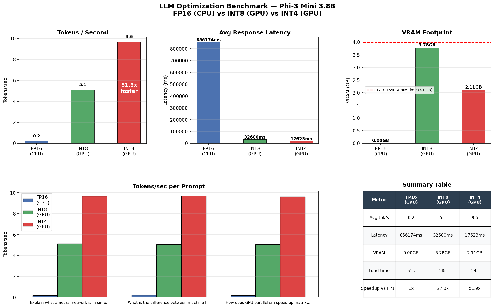

# Project 3 — LLM Interface Optimization (Capstone)

> Loading a real large language model, compressing it with quantization, and making it run on a budget GPU — while measuring exactly what you gain and what (if anything) you lose.

## What This Project Does

This is the capstone project of the GPU optimization series. It takes **Phi-3 Mini** — Microsoft's state-of-the-art 3.8 billion parameter language model — and benchmarks it across three precision levels:

- **FP16 on CPU** — the unoptimized baseline, no GPU involved
- **INT8 on GPU** — 2x memory compression using 8-bit quantization
- **INT4 on GPU** — 4x memory compression using 4-bit NF4 quantization (fits in 4GB VRAM)

It then wraps the best configuration in a **working interactive chat interface** that runs locally on the GTX 1650.

## Results (NVIDIA GeForce GTX 1650, 4GB VRAM)

| Config | Tokens/sec | Avg Latency | VRAM | Speedup |
|---|---|---|---|---|
| FP16 (CPU) | 0.2 | 856,174ms | 0.00 GB RAM | baseline |
| INT8 (GPU) | 5.1 | 32,600ms | 3.78 GB VRAM | 27.3x |
| INT4 (GPU) | **9.6** | **17,623ms** | **2.11 GB VRAM** | **51.9x** |

**INT4 NF4 quantization is 51.9x faster than the FP16 CPU baseline** — and uses only 2.11 GB of VRAM, comfortably within the GTX 1650's 4 GB limit.



---

## Background — Key Concepts Explained

### What is Phi-3 Mini?
Phi-3 Mini is a 3.8 billion parameter language model released by Microsoft in 2024. Despite being much smaller than models like GPT-4 or LLaMA 70B, it performs surprisingly well on reasoning tasks because it was trained on very high-quality data. It's an ideal choice for local deployment on consumer hardware.

### What is quantization?
Neural networks are made of numbers — billions of them. By default these are stored as **FP32** (32-bit floating point), or **FP16** (16-bit). Quantization reduces the number of bits used to store each weight:

```
FP32  →  32 bits per weight  →  full precision, most memory
FP16  →  16 bits per weight  →  half memory, minimal quality loss
INT8  →   8 bits per weight  →  4x less memory than FP32
INT4  →   4 bits per weight  →  8x less memory than FP32 ← what we use
```

The tradeoff is that lower precision = smaller representation = theoretically less accuracy. In practice, modern quantization techniques like **NF4** (Normal Float 4) are so clever that the quality loss is nearly imperceptible.

### What is NF4?
NF4 (Normal Float 4) is a quantization data type invented specifically for neural networks. Unlike regular INT4 which distributes values linearly, NF4 distributes them according to a normal distribution — which is exactly how neural network weights are distributed. This makes it significantly more accurate than naive INT4 quantization.

### What is double quantization?
This project uses `bnb_4bit_use_double_quant=True` — a technique that quantizes the quantization constants themselves, saving an additional ~0.4 GB of memory. It's a refinement on top of NF4 that costs almost nothing in quality.

### How does quantization affect tokens/second?
Somewhat counterintuitively, quantization **increases** throughput on GPUs because:
1. Smaller weights mean more of the model fits in fast GPU memory (VRAM)
2. Less data to move = less memory bandwidth pressure
3. Modern GPUs have hardware accelerated INT8/INT4 operations

This is the key insight: **quantization is not just a memory trick — it's a speed optimization too.**

### Why does the FP16 CPU version exist as a baseline?
Without a GPU, running a 3.8B parameter model in FP16 requires ~7.6GB of RAM and is very slow. This baseline shows what inference looks like without GPU acceleration — exactly the scenario that motivates GPU deployment.

---

## The Code

### `benchmark.py`
Loads Phi-3 Mini in all three configurations, runs 3 benchmark prompts through each, and generates a 5-panel comparison chart covering:
- Tokens per second (throughput)
- Response latency
- VRAM footprint vs GTX 1650 limit
- Per-prompt breakdown
- Summary table

### `chat.py`
An interactive terminal chat interface using the INT4 quantized model. Features:
- Full conversation history (multi-turn)
- Real-time tokens/sec display after each response
- Commands: `reset` to clear history, `stats` to see VRAM usage, `quit` to exit

---

## Model Architecture

Phi-3 Mini uses a **decoder-only transformer** architecture:

```
Input text
    ↓ Tokenizer (text → token IDs)
    ↓ Embedding layer
    ↓ 32× Transformer blocks:
        │  Multi-head attention (RoPE positional encoding)
        │  Feed-forward network (SwiGLU activation)
        └  RMSNorm + residual connections
    ↓ Language model head
Output: probability distribution over next token
```

3.8 billion parameters, 32 layers, 32 attention heads, 3072 hidden dimension.

---

## Hardware & Software

- **GPU:** NVIDIA GeForce GTX 1650 (4GB VRAM, Turing, 896 CUDA cores)
- **CUDA:** 12.1
- **PyTorch:** 2.5.1
- **Transformers:** 4.47.1 (Hugging Face)
- **bitsandbytes:** quantization library (INT8/INT4)
- **Python:** 3.11

## Setup & Run

```bash
# Install dependencies
pip install transformers==4.47.1 bitsandbytes accelerate matplotlib

# Run the full benchmark (downloads Phi-3 Mini ~2.4GB on first run)
python benchmark.py

# Run the interactive chat
python chat.py
```

> **Note:** Phi-3 Mini downloads automatically from Hugging Face (~2.4GB for INT4). First run takes a few extra minutes.

---

## What I Learned

- How transformer-based LLMs work at the architecture level
- What quantization is and why NF4 is better than naive INT4
- How bitsandbytes enables INT4/INT8 inference with one config object
- Why quantization increases throughput, not just reduces memory
- How to build a multi-turn chat interface with conversation history
- The full stack of LLM deployment: model → quantize → tokenize → generate → decode

---

## Project Series Summary

This is the final project in a 4-part GPU optimization series:

| Project | Topic | Key Result |
|---|---|---|
| [Project 1](../project-1/) | CNN Training — CPU vs GPU | **2.8x** training speedup |
| [Project 2](../project-2/) | TensorRT Inference Optimizer | **2.34x** inference speedup |
| [Project 4](../project-4/) | CUDA Data Pipeline | **2.1–3.4x** preprocessing speedup |
| **Project 3** | **LLM Quantization (Capstone)** | **51.9x** tokens/sec with INT4 vs FP16 CPU |

Together these demonstrate the full ML stack: data ingestion → model training → inference optimization → LLM deployment.
